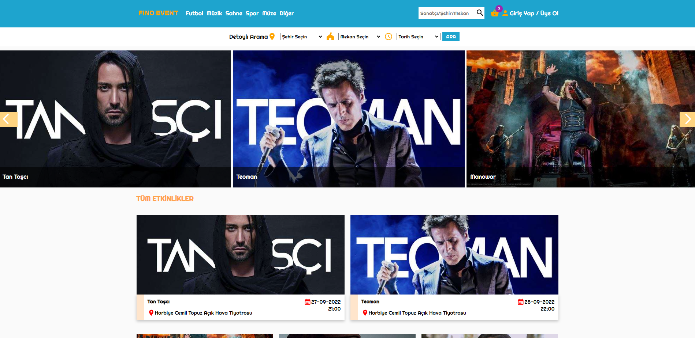
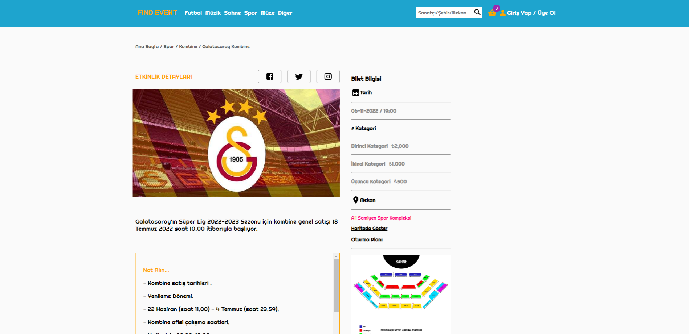

# Find Event

🔸 Find ticket that is concert,soccer or kind of entatrtaiment and buy it. <br>
🔸 Create to-do list that include task, responsibility... <br>
🔸 This web app built with using [React](https://reactjs.org/). <br>

## 💻 Setup <br>

### Install Dependencies

```
npm install
```

### Run the App in the Dev Server

```
npm start
```

### to Build for Production

```
npm build
```

## 🔥 Technologies and Libraries <br>

✔️ React.js <br>
✔️ TypeScript <br>
✔️ react-router-dom <br>
✔️ redux <br>
✔️ redux-toolkit <br>
✔️ dayjs <br>
✔️ metarial-ui <br>
✔️ react-icons <br>
✔️ react-hook-form <br>

## 📷 Screenshot <hr>


<br>
<br>

